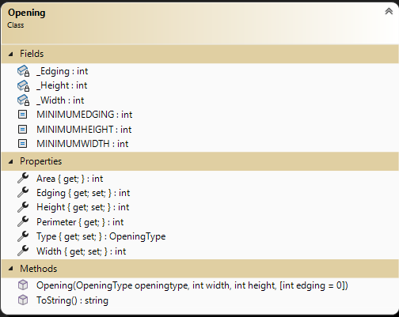
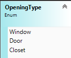

# OOP Training

> This is the first of a set of exercises that follow the evolution of a program to manage renovation projects. This set is cumulative and will build upon previous exercises.

## Objectives

This exercise will allow you to demonstrate:

- your ability to read and interpret a class diagram
- coded class based on a class diagram and set of specifications
- implement validation within a class given a set of specifications
- use unit testing to vertify the coded class is valid
- use of a common set of methods for validation

## Overview 

Your task is to generate a set of simple data types to represent the primary objects for managing renovation projects.

For this exercise, place all the required data types in the namespace `RenoSystem` and ensure that they are `public`. Create your project as a Class library (.NET Core 8). This project will be used for **both** Exercise 1 and 2. In Exercise 1, you will create a class that will contain specifications for an opening (such as a door, a window, a closet, etc.) Certain characteristics of the class are set and cannot be altered. You will need to read the specifications carefully to determine the access levels for the class characteristics. You have been supplied a Unit Tests project that will inform you if your work will meet specifications and hold appripriate data. **Ensure you follow the given class diagrams for the Unit Tests to work.**

### General Validation Rules

All validation is to be performed by throwing exceptions. Here are some general requirements.

- Exceptions must have meaningful error messages with keywords (ex: positive, minimum).
  - missing value in parameter: `ArgumentException`
  - incorrect value if parameter: `ArgumentException`
- Error messages must include details about the limits for acceptable values.
- Measurements must always be positive and non-zero numbers. Measurements are to be in whole number increments (eg: 254) (all measures are in metric centimeters).
- All string information must contain text. Null, empty, and plain white-space text is not allowed. Sanitize your strings by trimming the leading and trailing whitespace.
- Use constants for minimum values.
- All **public** level mutators must have necessary validation within the properties.

### The `Opening`

Openings cover a variety of types such as windows, doors, panels which hide items such as entertainment electronics, and closets. The following is opening information:

- **Width** (e.g.: "110 cm") - Identifies the phyiscal size of the opening.
- **Height** (e.g: "230 cm") - Identifies the phyiscal size of the opening.
- **Edging** (e.g. "12 cm") - Identifies the width of any decorative edging.
- **Type** - Value that represents the type of this opening.
- **Area** - Value of the Opening area (width * height)
- **Perimeter** - Value of the distance around the Opening ((width + height) * 2)

Openings usually are framed but not necessarily such as basement windows. Openings width and height are the phyiscal size not the size of the item in the opening. Example, a door has a frame and the door. This is positioned within the opening and shimmed to fit correctly. Each opening may or may not have decorative edging.

You will need a greedy constructor for this class. All properties with both a get and set must be `public`. Some properties only have a getter, because they calculate their values based on the state of the Opening. Create an overloaded .ToString() method for the class to display all the instance values in a comma separated value string. The order of values on this string must match the parameter order of the constructor.

Note the following:

- Minimum Width is 50 cm.
- Minimum Height is 120 cm.
- A opening does not need an edging. Though a measurement is usually a positive non-zero value, Edging is special and can be zero (0).
- Minimum Edging if present (non-zero) is 10 cm.

  

### The `OpeningType`

Openings come in various structural types. Initially, we will consider only 3 types of openings: Door, Window, and Closet. Even though other common openings could be for electical outlets, light switches and recess lighting; they are not physical structural openings.

### The `Utilities`

Create a public static class called `Utilities`. This class will have public static methods which can be used to do common testing.

1. Create a method (single parameter) that will validate a numeric value to be a non-zero positive.
1. Create a method (two parameters; value and criteria limit) that will validate a numeric value is greater or equal to the criteria limit.

### Unit Testing Code

A unit testing project called `UnitTestingEx1` has been supplied for this exercise. Add it to your solution. The tests have been commented out. As you code items in your class you can uncomment the appropriate unit test to evaluate your code. There is **no** need to alter the code of the unit test. There is a separate unit test class for each of your classes.

----
## Submission

Commit your work in your **exercise** repository and sync to github.com.

## Evaluation

> ***NOTE:** Your code **must** compile. Solutions that do not compile will receive an automatic mark of zero (0).*
> 
> If you are unable to get a portion of the assignment to compile or work, you should:
> - Comment out the  portion of code
> - Identify the reason for the commented portion (such *as does not compile* or *does not work cause an abort*)

Your assignment will be marked based upon the following weights. See the [general rubric](../README.md) for details.

| Weight | Deliverable/Requirement |
| ---- | ----- |
| 5 | Opening (appropriate use of Utility methods included) |
| 1 | OpeningType |
| 2 | Utility methods (reusable validation methods) |
| 2 | Unit Tests: usage  |

----
[Return to exercises](../README.md)
