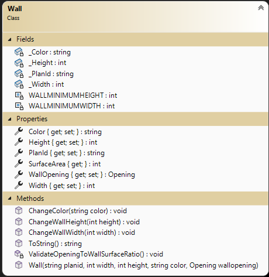
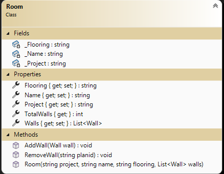
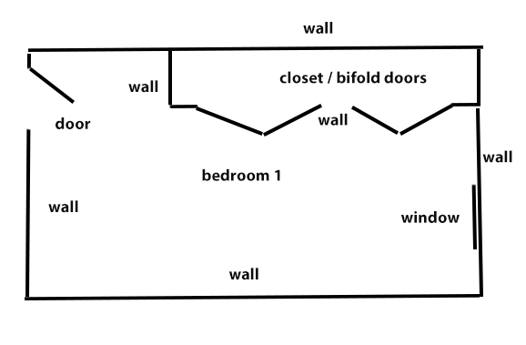

# OOP Training

> This is the second of a set of exercises that follow the evolution of a program to manage renovation projects. This set is cumulative and will build upon previous exercises.

## Objectives

This exercise will allow you to demonstrate:

- your ability to read and interpret a class diagram
- coded a composite class based on a class diagram and set of specifications
- implement validation within a class given a set of specifications
- code unit testing to vertify the coded class is valid
- import and use a supplied class
  
## Overview

Your task is to generate a set of simple data types to represent the primary objects for managing Reno project.

For this exercise, you will add additional classes to your `RenoSystem` class library project created in exercise 1. You will/may need to fix short-comings and issues for exercise 1. You will import one class and code a composite class. You will code a Unit Tests project that will inform you if your work will meet specifications. **Ensure you follow the given class diagrams for the Unit Tests to work.**

### General Validation Rules

All validation is to be performed by throwing exceptions. Here are some general requirements.

- Exceptions must have meaningful error messages with keywords (ex: positive, minimum).
  - missing value in parameter: `ArgumentException`
  - incorrect value if parameter: `ArgumentException`
- Error messages must include details about the limits for acceptable values.
- Measurements must always be positive and non-zero numbers. Measurements are to be in whole number increments (eg: 254) (all measures are in metric centimeters).
- All string information must contain text. Null, empty, and plain white-space text is not allowed. Sanitize your strings by trimming the leading and trailing whitespace.
- Use constants for minimum values.
- All **public** level mutators must have necessary validation within the properties.

## Supplied Class 

### The `Wall` (import this supplied class into your class library project)

Walls are the basic components of the house. Walls will be rectangles and have up to one opening for the purpose of this set of exercises (for simplicity). We need to track the wall's:

- **PlanId** (unique string to identify wall during renovation)
- **Width** (in centimeters e.g.: "480")
- **Height** (in centimeters e.g.: "240")
- **Color** (e.g.: Ivory White)  
- **WallOpening** (e.g.: door, window, closet), and
- **SurfaceArea** - Value of the Wall area (width * height) minus the Opening area (if present)
  
  The class has been coded and does **not** need to be altered. Examine the class. **Note that WallOpening is datatype Opening.** You will discover that the properties have **private** sets. There are methods that are used to alter the properties: height, width and color. PlanId is not changable. This demonstrates another technique in creating classes. **This class makes use of the 2 methods coded in the Utilities class to validate the numeric height and width.**

Note the following:

- Minimum Width is 26 cm.
- Minimum Height is 100 cm.
- The total area (width X height) of an opening in the wall must be less than 90% of the wall area. The 10% represents the need for structural framing of the openings.
- A wall does not need to have an opening (nullable instance)

## Required Class

### The `Room` 

A Room is a set of walls with or without openings. A Room represents an distinct area of a residence. Rooms will normally have 4 or more walls but may have as little as one wall (open layout plan). The Room must at minimum have: a Project identifier and a Name when created. New walls are added to the room one-by-one. The collection of Walls will have a `set` property of `private` with a public getter. This will allow one to supplied a collection of Walls at construction time only. Adding and removing a wall after instance creation must be done via methods within the class. The Room will track:

- **Project** - This identifies the Renovation project. Cannot not be null.
- **Name** - This identifies the Room. Cannot not be null.
- **Flooring** - This identifies the material of the floor such as tile, carpet, hardwood, etc. Can be null. Should not contain an empty or blank string.
- **Walls** - This is the collection of walls for the Room.
- **TotalWalls** - Returns the number of walls for this room in the List&lt;Wall&gt; collection.

#### Methods

Add method `AddWall(Wall wall)`

Create a behaviour called AddWall that will receive a wall instance to add to the Walls collection. If a parameter value is missing throw an `ArgumentNullException`. Validate that the wall planid (planid is a property within the Wall instance) is unique to the wall collection, `Walls`. If the planid already exists in the Walls collection, throw an `ArgumentException` message containing the wall planid parameter in the message string. If the data is valid, add the Wall instance to the collection.

Remove method `RemoveWall(string planid)`

  This method will locate and remove the wall matching the parameter. If the parameter value is missing throw an `ArgumentNullException`. If the wall cannot be located, throw an `ArgumentException` message containing the supplied parameter in the message string. Remove the wall if a matching wall exists.

----

## Create Unit testing project

 Create a new unit testing project  (.Net Core 9.0) called `UnitTestingEx2` for this exercise within your solution. Add your class library reference to this testing project. You are to use FluentAssertions within the xUnit testing project. The following table indicates the unit test cases to create. Unit Test names are left up to you. The required tests are outlined in the following table. Include an assert to check the read-only parameter TotalWalls in any test that changes the Walls collection.

#### Unit Tests

 | Class item | Success/Exception | Specifications |
| ---- | --------- | ------------------- |
| Room Constructor | Success | Create a room with a collection of Wall instances and Floor value. Assert the collection loaded as supplied.|  
| Room Constructor | Success | Create a room without a collection of Wall instances but with a Floor value.|  
| Room Constructor | Success | Create a room without a collection of Wall instances and no floor value. Hint: check flooring with null, empty and blank strings.|
| Room Constructor | Exception | A missing Name will throw an `ArgumentNullException` |  
| AddWall  | Success | Add a wall to the Wall collection. |  
| AddWall  | Exception | Missing wall instance parameter value (`ArgumentNullException`) |  
| AddWall  | Exception | Wall planid parameter value already exists (`ArgumentExpection`). Check planid value is in the thrown message. |
| RemoveWall  | Success | Removes a wall from the Room instance |
| RemoveWall  | Exception | Missing planid parameter value (`ArgumentNullException`).  Hint: check with null, empty and blank strings. |
| RemoveWall  | Exception | PlanId not found (`ArgumentExpection`). Check planid value is in the thrown message. |  

----

## Evaluation

> ***NOTE:** Your code **must** compile. Solutions that do not compile will receive an automatic mark of zero (0).*
>
> If you are unable to get a portion of the assignment to compile or work, you should:
> - Comment out the  portion of code
> - Identify the reason for the commented portion (such *as does not compile* or *does not work cause an abort*)
>
> Other concerns (Examples but not linited to:)
> - commits do not reflect incremental development;
> - unstructure code;
> - other instuctor requirements;
> - class standards;
> - 
Your assignment will be marked based upon the following weights. See the [general rubric](../README.md) for details.

|  Weight | Deliverable/Requirement |
| ------- | ------------- |
|  1 | Wall imported into library asis and used |
|  3 | Room properties and constructor |
|  2 | Room AddWall method |
|  2 | Room RemoveWall method |
|  3 | Unit tests: Constructor and properties |
|  3 | Unit tests: AddWall |
|  3 | Unit tests: RemoveWall |
| ---- | ----- |

[Return to exercises](../README.md)
