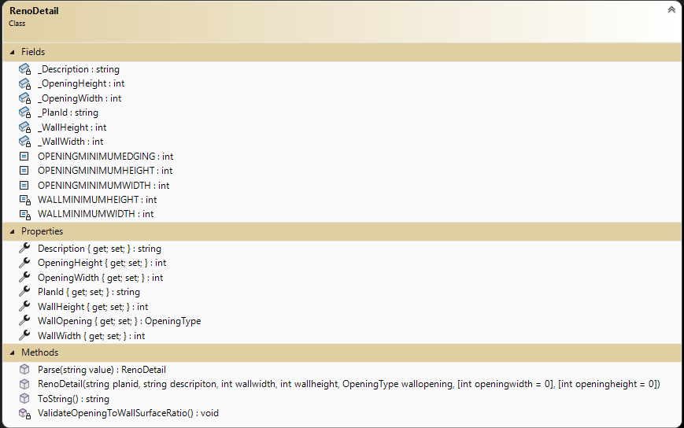
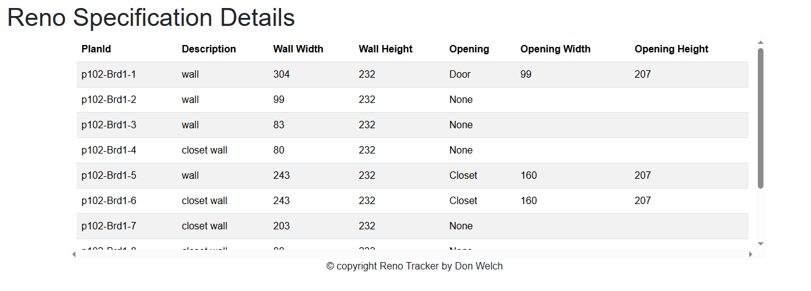
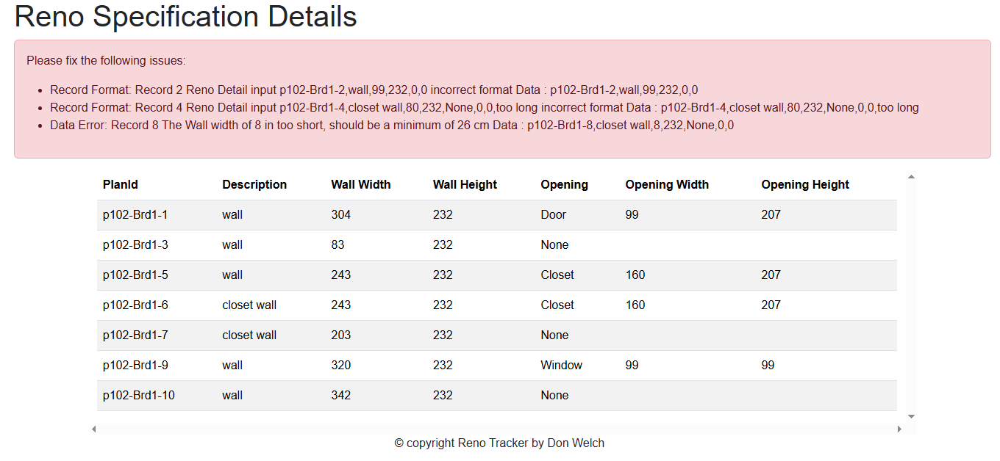
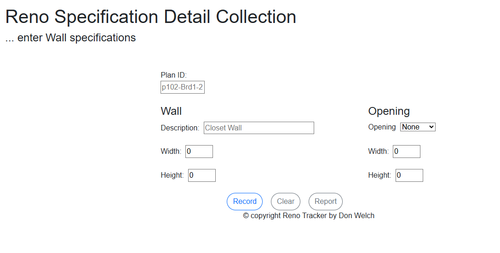
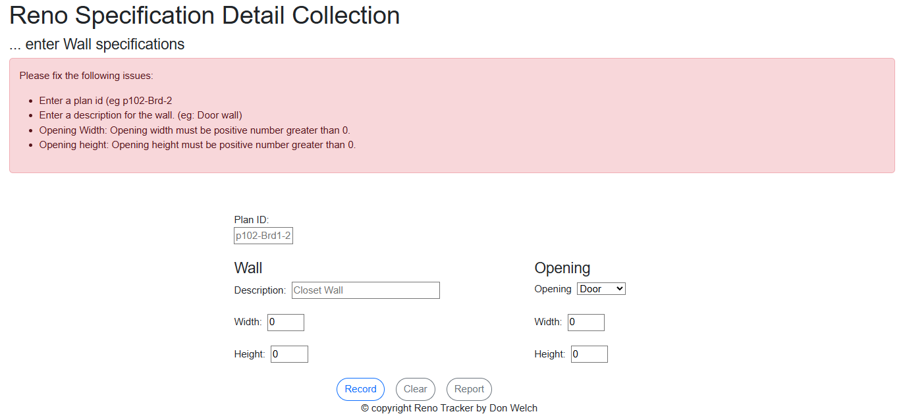

# Book Review - Web Application and Form Input

> This exercise is part of a series of exercises to manage information on a collection of renovation projects.
> In this exercise you will create a Blazor web application project.
> **RenoTracker** is a site to keep up-to-date with your renovation projects.
>

## Objective

Upon completion of this exercise, you will have demonstrated the ability to:

- your ability to read and interpret a class diagram
- to read and understand the code of a given class
- create a web application with several web pages
- implement a data entry form with input validation
- implement a tabular report from a collection of data
- use a CSV file (append data (write), read and display)

----

## Project/Solution Setup

You are to create a new ASP.NET Core **Blazor** Web Application project within a new solution for this exercise. Create the project for .Net Core 8 and give your project the name **RenoTrackerWebApp`**. Check with your instructor about specific settings/customizations for your Blazor project.

To ensure that your web application works, build and run your project. A browser window should open in a local hosted port.(Example https://localhost:5001 , your port may be different).

The styling for your application is up to you. The default template for the `web app` project uses Bootstrap built in, but you can use any website styling you choose. (**Note:** Your instructor may offer specific guidance/restrictions with regard to styling.)

### Modify `Home`

Modify the home page to include the following.

- The title line for the site (**Book Reviews**)
- A simple logo for the site
- One to two paragraphs of welcome and summary description for the site

### Update the `MainLayout`

Put your name and section identifier in the `<footer>` element for the copyright information.

### Update the `NavMenu`

Also ensure that the menu navigation has the following items.

- A link to the home page (`Home`) with some text (eg BRbyU)
- A link to the renovation detail data entry page (`/RenoCollection`) with an appropriate text
- A link to the revonation detail report page (`/RenoReport`) with an appropriate text
- A link to the privacy page (`/Privacy`) with the text "Privacy"
- Create your own or find an image that you wish to use as a brand image for your menu. (If you are using the supplied bootstrap menu, alter the *brand* text string to include a thumbnail imagine 40 X 40 pixels.) If you are using an image that someone else created, make sure that you give credit to the individual on your Privacy page.

> ***Tip:** Create placeholder pages for the new navigation links. You will need to modify the content of those pages as noted later to the specifications. Ensure each page has an appropriate page title (i.e.: the title in your browser tab) for its content. Run your app and check the navigational links.*
>

### Add `Model` folder and class definition

A zip file has been supplied for you. This file contains the Model folder. Unpack the file and place the Model folder into your web application project (same level as the Data folder).

The `RenoDetails` class will be used for your data (see below). The files an enum class `OpeningType` and a utility method class `Utilities`  will be used in support of your data and data entry control respectively. The Utilties class contains a methods that help with property value validation.



### Add a `Data` Folder and file

Add a folder to your web application project and give it the name `Data`. You will need to place your CSV file into this folder. Create a text file called `GoodTestFile.csv` within this folder. In this file, you will need to enter the following sample CSV data content as your initial set of good data. You will need to create a second test file that contains **both** good and bad data and a third file
that contains no records (an empty file).

```csv
p102-Brd1-1,wall,304,232,Door,99,207
p102-Brd1-2,wall,99,232,None,0,0
p102-Brd1-3,wall,83,232,None,0,0
p102-Brd1-4,closet wall,80,232,None,0,0
p102-Brd1-5,wall,243,232,Closet,160,207
p102-Brd1-6,closet wall,243,232,Closet,160,207
p102-Brd1-7,closet wall,203,232,None,0,0
p102-Brd1-8,closet wall,80,232,None,0,0
p102-Brd1-9,wall,320,232,Window,99,99
p102-Brd1-10,wall,342,232,None,0,0
```


## Web Application Content

> ### `Pages you create should have a feed back and error message area`

### The `/Privacy` Page

In your `Privacy.razor` component includes the following:

- **`Author: Your_name`** with your full name replacing the *`Your_name`* portion
- **`Section: X##`** with the *`X##`* being your section number (e.g.: `E01`)
- **`Instructor: Some Body`** with your instructor's name (i.e.: replace *`Some Body`* with the appropriate name)
- **`Known Bugs:`** After this heading, include an un-ordered list of known bugs (items that are non-functional or incomplete) with respect to the requirements for this exercise.
- include any Credit and attributions for images that are used and you did not create

In addition, you may use images or links about copyright information that may have been used 
during your class demonstration.

### The `/RenoReport` Page

In your `RenoReport.razor` component, you are to display the records of renovation details as read from the CSV file created earlier. A mockup layout image of the required report has been supplied. You will supply an appropriate tilte for the page. You will read the file and create a collection using your RenoDetail class. Your page will display this collection. Display a message if the collection is empty. Your page must process the entire data file and report any record that does not meet the expected input format. Review the `RenoDetail` class `Parse` method for expected data record format. Your instructor may include any addition layout requirement.





### The `/RenoCollection` Page

In your `RenoCollection.razor` component, you are to provide the user the ability to add renovation details to a text (CSV) file in append mode. Your page does not need to have the same layout **but** must use the variety of basic **HTML** controls within the mockup for the same data. You **must** put some effort into making your form look organized and presentable. **Do not use EditForm or EditForm controls (except InputRadioGroup and InputRadio)** You will validate the incoming data and display any fields in error. Use the `RenoDetail` class as a guide for validation. Individual unique error messages will be used to indicate the error.

#### Submit Buttons

- **Collect** will validate the incoming data and save to the CSV file if correct.
- **Clear** will reset the fields to empty input state.
- **Report** will transfer the user to the review Report page.



#### Validation

Be sure to validate the incoming data and display any errors as a single summary with a list of specific problems; each individual error must have a unique message so that the user knows exactly what input is incorrect (i.e.: do not generalize your error messages). **Do only the indicated error checking below.**

- ensure the PlainId and Description are present with data.
- ensure the Opening width and height has data > 0 if the opening type is not None. If opening type is not None, check it is positive non-zero. (Tip: Utilities class)



## Submission

Commit your work in your **exercise** repository and sync to github.com.

## Evaluation

> ***NOTE:** Your code **must** compile. Solutions that do not compile will receive an automatic mark of zero (0).*
>
> If you are unable to get a portion of the assignment to compile or work, you should:
> - Comment out the  portion of code
> - Identify the reason for the commented portion (such *as does not compile* or *does not work cause an abort*)
>

Your assignment will be marked based upon the following weights. See the [general rubric](../../README.md#generalized-marking-rubric) for details.


|  Weight | Deliverable/Requirement |
| ------ | ------------- |
|  **1** | Use of supplied RenoDetail class |
|  **1** | Use of OpeningType enum, Utilities class |
|  **1** | Solution file structure as requested |
|  **1** | Site Navigation |
|  **2** | Home Page |
|  **2** | Privacy page |
|  **1** | Logo |
|  **5** | Report page (testing of good, bad and empty files, File I/O, report presentation) |
|  **5** | Data Entry page (form presentation, File I/O, validation, prompt dialogue) |

----

[Return to exercises](../README.md)
