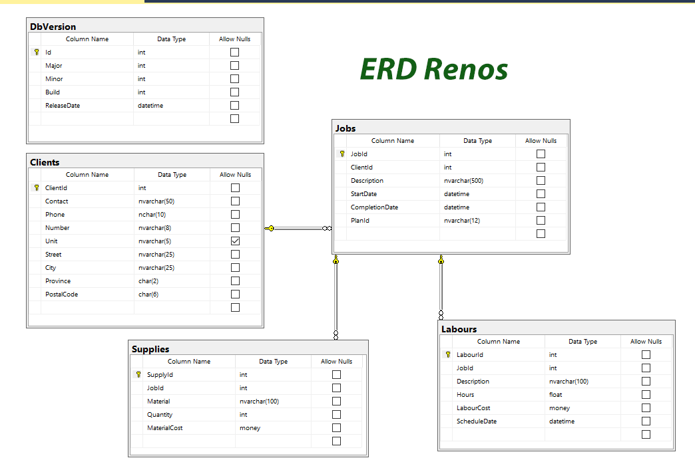

# Book Reviews - Ex04 - Database Querying Based on Filters

> This is the next in a series of exercises where you will be creating a website to query information onrenovations demonstrating Client/Server techniques using data from a database.
> **RenoTracker** is a web application for those who want to keep information on home renovation jobs within their business. To start application development, we will limit the data to maintain in a database to client, job, material and labour.
>
## Objectives

This exercise will allow you to demonstrate:

- your understanding of basic Client-Server architecture
- your ability to create a Client-Server solution consisting of a web application and application class library
- set up your application class library to interact with a database using EntityFramework with entities created by Reverse Engineering
- create a series of server services to return data from the class library to your web page
- implement a tabular report from a collection of data supplied by a service call to your class library
- demonstrate your understanding of filter searches to obtain data from a database using appropriate Linq queries
  
## Overview

You are to create a Client Server solution containing a Blazor .Net 9.0 web application and an application library (.Net 9.0 class library).

Use the following names:

- Solution: `CSRenoSolution`
- Web Application: `RenoTracker`
- Application Library: `RenoSystem`.
  
A key aspect of the site is to allow users to search the database to find supply information on various jobs by job id. Your task in this assignment is to provide that functionality. You will configure your web application to use the class library via dependency injection. You will create a new page that will display a tabular report using data returned from a class library service.

Use the demos presented in class as a guide to implementing this exercise.

### Database setup

Use the supplied database found in this repository: `Renos.bacpac` has been supplied to you for this exercise. Restore this database to your machine. Use Microsoft SQL Management Studio (use Import Data-tier Application) to restore the `Renos.bacpac` file as the exercise database. **The database is to be named `Renos`.**

### Client Service Web Application

1. Create a .Net Core 9 Blazor web server application project called `RenoTracker`. **Turn off the Configure for HTTPS check box.** This project will reference your class library. Include the sample pages. You may use images from Exercise 3.

2. Create a .Net Core 9 class library project called `RenoSystem`. Your web project will reference this project. Add 3 folders to your class library project: BLL, DAL and Entities (your instructor may have named this folder Models).

*Remember that Github does not track empty folders, so you might wish to add a dummy.txt file in each folder
 if you intend to commit and push at this time. You may remove these dummy files as you add other files to the folder.*

### Client Service Application class library using a database

### A) Create and Verify Entities

You will use reverse engineering, via EF Core Power Tools, to create your entity classes that map to the database. Add the necessary NuGet packages to handle data from a MS SQL database if they are not added during the reverse engineering: Microsoft.EntityFrameworkCore(9.0.1) and Microsoft.EntityFrameworkCore.SqlServer(9.0.1)

- Your EF Core verion should be EF Core 9.
- Select all tables (only the tables).
- Take the default Context name and namespace.
- Turn on Pluralize or singularize; Use table and column names; Use DataAnnotation; and Install the EF Core options.
- Place the entity classes in your Entities folder and the context class in your DAL folder.
- Alter the context class access level to **internal**.



### B) Verify DAL Context

In the "DAL" folder, a file called `RenosContext.cs` was created which will contain the `RenosContext` class.

- Ensure it inherits from `DbContext`.
- Your class should have a constructor for DbContextOptions<> options injection.
- Change the access level of the context class to **internal**.

*Your DbSet properties for your entity classes should also be present.*

### C) Extension class creation

This class will contain the dbcontext and transient registerations that will be available for dependency injection in your web application.

The class method will be called within the web application `Program.cs` file.

- Create a class called `RenoSystemExtensions` at the root of the application library. Change the class to be public static.
- Add the static method `RenoSystemExtensionServices`. Check you class demo for appropriate parameters.
- Within the method, you will register your DbContext and the AddTransient factory for your BLL service classes.

As you code, you will need to resolve references to needed namespaces holding your context class and service classes.

### D) BLL Services

You will need to create each of the services below.

- Each service class will need an appropriate internal constructor that requires an instance of the `RenosContext` as a parameter.
- Save the parameter value into a private readonly variable. As you code, you will need to resolve references to needed namespaces holding your context class and entity class.
- Once you have created the class, register the class in your extension method via AddTransient.
- **If a method has a string parameter, ensure one was passed and, if not, throw an `ArgumentNullException`.**

**JobServices class**

Create a new service class called `JobServices` in your BLL folder. This class will contain one service method to return the complete list of Jobs. This query list will be sorted alphabetically by Description.  Remember to register your service class.

In this class, create a public method called `Job_GetList()` that:

- Has no parameters
- You will need to include the assoc1ated Client instance for each job.
- Returns an ordered collection (by Description) of all records of the Job entity.

**SupplyServices**

Create a new service class called `SupplyServices` in your BLL folder. This class will contain two service methods:  to return the page list of supplies for a specified job ordered by Material and another to return the total number of materails for a specified job. Each method will receive a filtering parameter for a specified job. One method will also receive the data necessary to implement paging and return only the records needed for the current page that will be displayed. Remember to register your service class.

Create a public method called `GetByJobId(int)` that:

- Has one parameter for the data
- Returns a collection of Supply records, ordered alphabetically by Material, where the JobId equals the parameter value for the current page to be displayed.
- The data parameter value will be an integer job id value.

Create a public method called `GetJobSupplyCount(int)` that:

- Has one parameter for the data
- Returns the total count of records where the JobId equals the parameter.

After creating these classes, rebuild your Application Class Library. You should get a successful build.

### Overview Web Application Functionality and Requirements

### A) Create your database connection string in the appsettings.json file

```csharp
"ConnectionStrings": {
    "RenoDB" : "Server=xxxx;Database=Renos;Trusted_Connection=true;MultipleActiveResultSets=true"
  }
```

Replace the "Server=xxxx" in the above with your server name as demonstrated in class.

### B) Setup the service dependency registration for the web application  

This will be done within your `Program.cs` file. Use your class lesson demonstration to complete this process.
You will need to add a project reference to the web application pointing to the class libray.

### C) Home Page

Change the home page to include your name, known bugs and last date modified. If you are using images that are not sourced by you, add a Credits and attributions note. Format design is up to you.


### D) Overview Query Page

### Query Page to search Supplies needed for a specific Job

- Create a `Query.razor` web page component.
- Use project dependency injection for the `JobServices` and `SupplyServices` classes.
- Be sure to add a nav item so that this page can be navigated to using the nav menu. Use the text "Query" for the link.
- Add an appropriate title to the page and the title browser tab.

Details of your display can be found below:

The `Query` page will display summary information on the Books data in an HTML table with headings:

- `Material`
- `Quantity`
- `Material Cost`

#### Requirements

- This query page will have Drop Down List filter showing the job description and start date. Use the following text display format:  Bedroom (May 23, 2025) - Contact  where Contact is the Client Contact.
- Search button will execute an event handler to retrieve the Supply data using the search Job ID value.
- Clear button will execute an event handler to reset the page to its opening state.
- Demonstrate table scrolling by limiting your display height to ~10 lines at a time.
- Display a message if no supplies have been found for the selected job.

### Samples

Only present the data fields as shown below:


To ensure that your web application works, build and run your project.

## Submission

Commit your work in your **exercise** repository and sync to github.com.

## Evaluation

> ***NOTE:** Your code **must** compile. Solutions that do not compile will receive an automatic mark of zero (0).*
> 
> If you are unable to get a portion of the assignment to compile, you should:
> 
> - Comment out the non-compiling portion of code
> - Identify the non-compiling portion with a **Incomplete Requirements** heading, noting the item's
>  

Your assignment will be marked based upon the following weights.

|  Weight | Deliverable/Requirement |
|  ---- | --------- |
|  **1** | Create appropriate ASP.NET Core Class Blazor web server application (.net core 9) |
|  **1** | Create appropriate ASP.NET Core Class Library (.net core 9) |
|  **1** | Uses reverse engineering to create Entities with custom validation message and DAL classes |
|  **2** | Setup project references, necessary NuGet packages, and service registration using extension class |
|  **2** | `JobServices.cs` BLL service class|
|  **2** | `SupplyServices.cs` BLL service class |
|  **3** | `Query.razor` setup appropriate controls for query argument (job id) and table display (Supplies) |
|  **3** | `Query.razor` Query Entry page (web page event processing including appropriate error handling). |
|  **1** | `Query.razor` Clear page (button/event) |
| ---- | --------- |

----

| Weight | Breakdown |
| ----- | --------- |
| **1** | 1 = Proficient (requirements are met; meets all class standards; contains acceptable coding structures)<br />0 = Incomplete (requirements not met; missing large portions/requirements; major errors; class standards not meet; contains unacceptable coding structures) |
| **2** | 2 = Proficient (requirements are met; meets all class standards; contains acceptable coding structures)<br />1 = Limited (requirements adequately met; missing some minor portions; minor errors, class standards not meet; contains unacceptable coding structures)<br />0 = Incomplete (requirements not met or missing large portions; major errors; class standards not followed; contains unacceptable coding structures) |
| **3** | 3 = Proficient (requirements are met; meets all class standards, contains acceptable coding structures)<br />2 = Capable (requirements are adequately met; minor errors; class standards not meet; contains unacceptable coding structures)<br />1 = Limited (requirements are partially met; major errors; class standards not meet; contains unacceptable coding structures)<br />0 = Incomplete (requirements not met or missing large portions; major errors; class standards not meet; contains unacceptable coding structures) |

----

[Return to exercises](../README.md)
